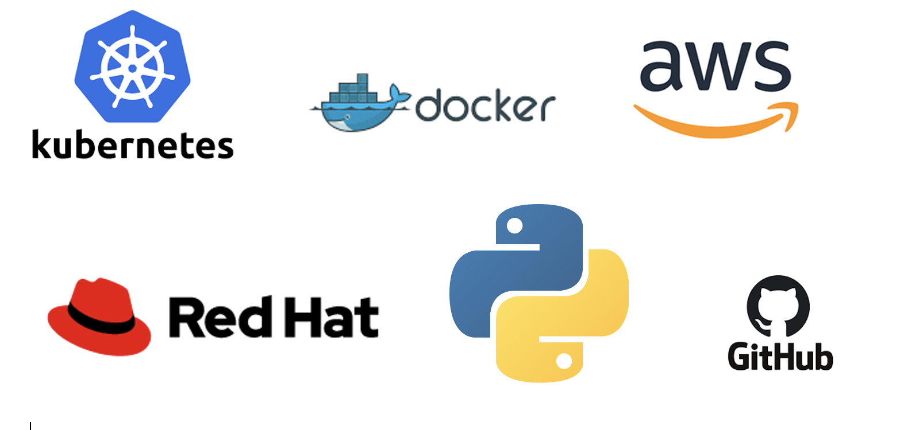
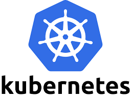
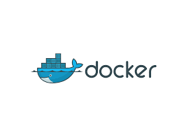
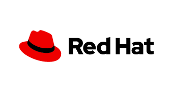

Text can be **bold**, _italic_, or ~~strikethrough~~.

[Projects](./project_page.md).
[Github Project](https://github.com/tgalicia).
# Moving to Tech
I have always had a love of exploring the why and how behind everything. Once I got behind the scenes of deployed applications, I was all in. My years in education have prepared me for a career in tech with the following skills:

*   Strong Communication
    
    
*   Ability to Manage Multiple Projects at once 
    
    
*   Team Collaboration 
    
    
*   Time Management 


*   Learning New Topics Quickly


    
* * *    


## Tools I'm Comfortable with




                        
 
        


* * *

### Feel free to Check out my Personal Projects

[Projects](./project_page.md).
[Github Project](https://github.com/tgalicia).


> This is a blockquote following a header.
>
> When something is important enough, you do it even if the odds are not in your favor.

### Header 3

```js
// Javascript code with syntax highlighting.
var fun = function lang(l) {
  dateformat.i18n = require('./lang/' + l)
  return true;
}
```

```ruby
# Ruby code with syntax highlighting
GitHubPages::Dependencies.gems.each do |gem, version|
  s.add_dependency(gem, "= #{version}")
end
```

###### Header 6

| head1        | head two          | three |
|:-------------|:------------------|:------|
| ok           | good swedish fish | nice  |
| out of stock | good and plenty   | nice  |
| ok           | good `oreos`      | hmm   |
| ok           | good `zoute` drop | yumm  |


### And a nested list:

- level 1 item
  - level 2 item
  - level 2 item
    - level 3 item
    - level 3 item
- level 1 item
  - level 2 item
  - level 2 item
  - level 2 item
- level 1 item
  - level 2 item
  - level 2 item
- level 1 item


```
The final element.
```
