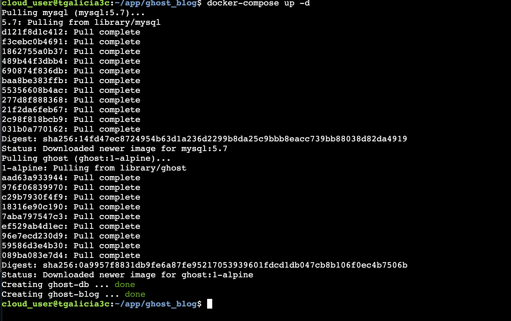
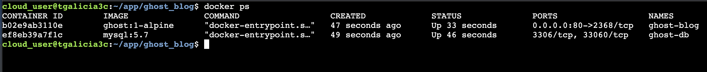

## Welcome to my Projects

Below you will find brief descriptions of completed projects. You can also check out the source code at [Github Project](https://github.com/tgalicia).

#### Ghost Blog Project
*   For this project, I created the docker compose file to create the two containers for the blog and the mysql database. Each container also had it's own volume on the local server. 

[back](./)
