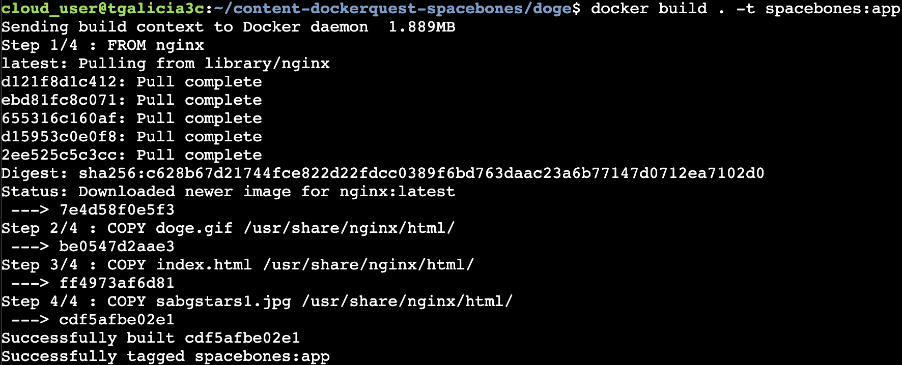
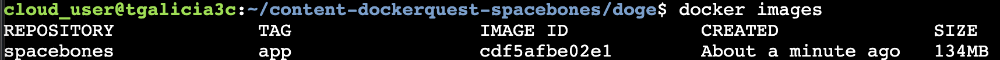
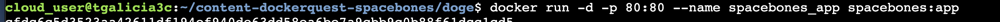
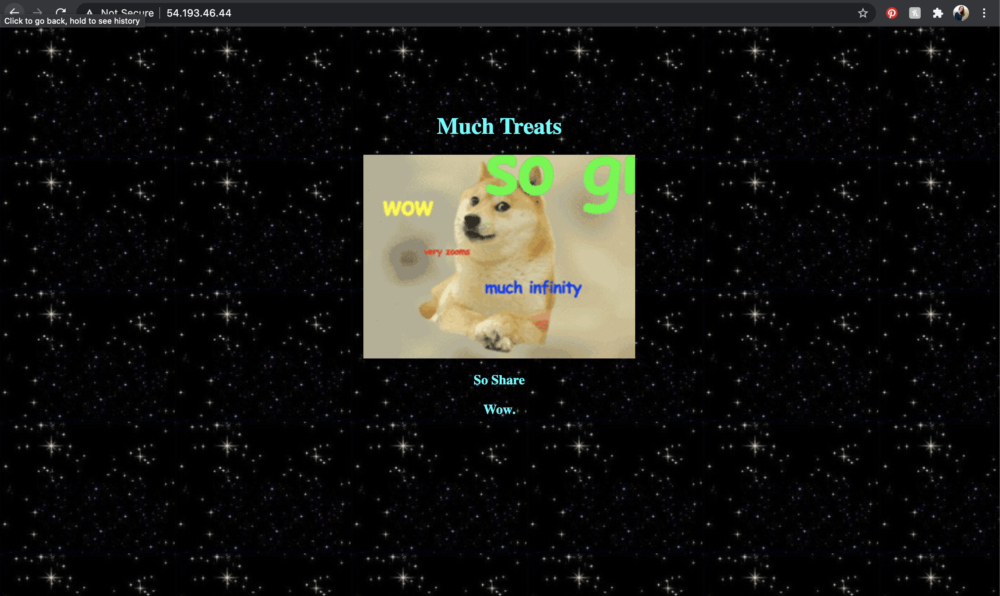
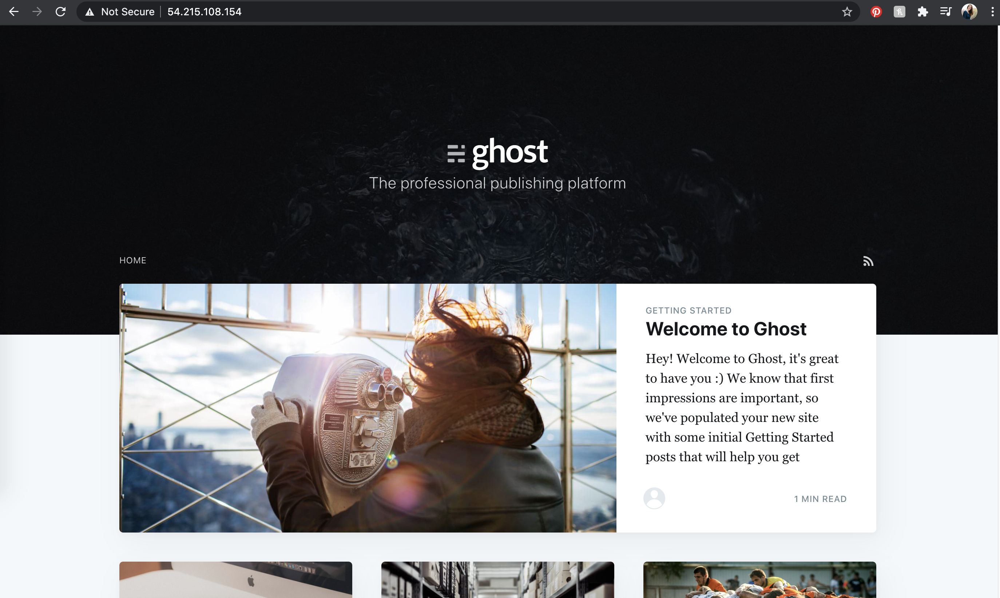
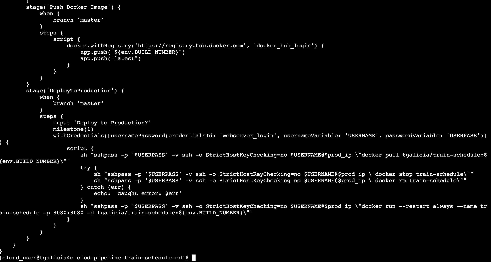
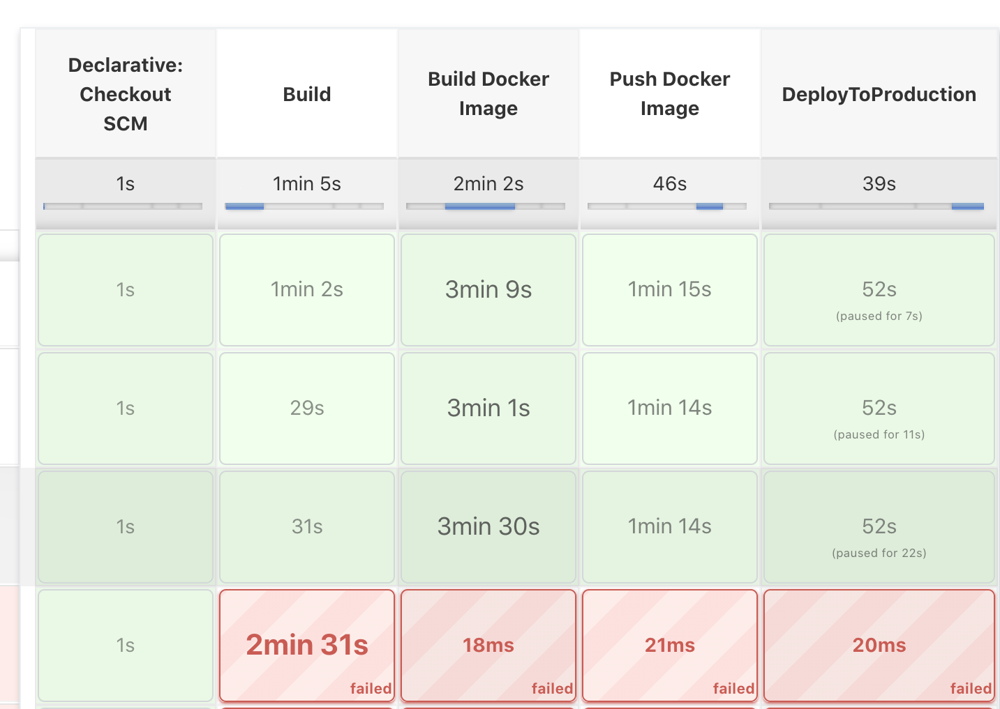
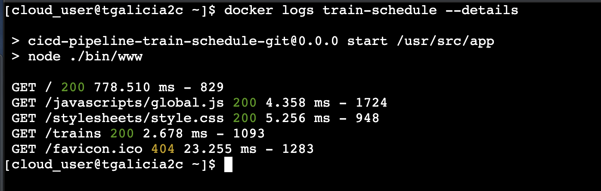
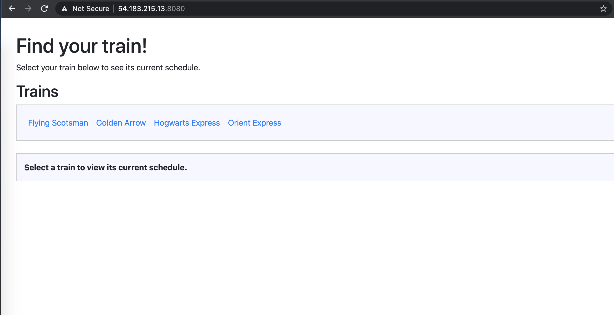

## Welcome to my Projects

Below you will find brief descriptions of completed projects. You can also check out the source code at [Github Project](https://github.com/tgalicia).

#### Spacebones Project
*   For this project, I created the dockerfile to run this java application on a local server. 

* * * 

#### Ghost Blog Project
*   For this project, I created the docker compose file to run a static ghost blog on my local server. The docker compose file create the two containers for the blog and the mysql database with each container also having it's own volume on the local server. 

* * *

#### Train Schedule Project
*   For this project, I created the dockerfile for the static train schedule app. Then I deployed the app from my SCM(Github) using Jenkins to a deployment server.

[back](./)
